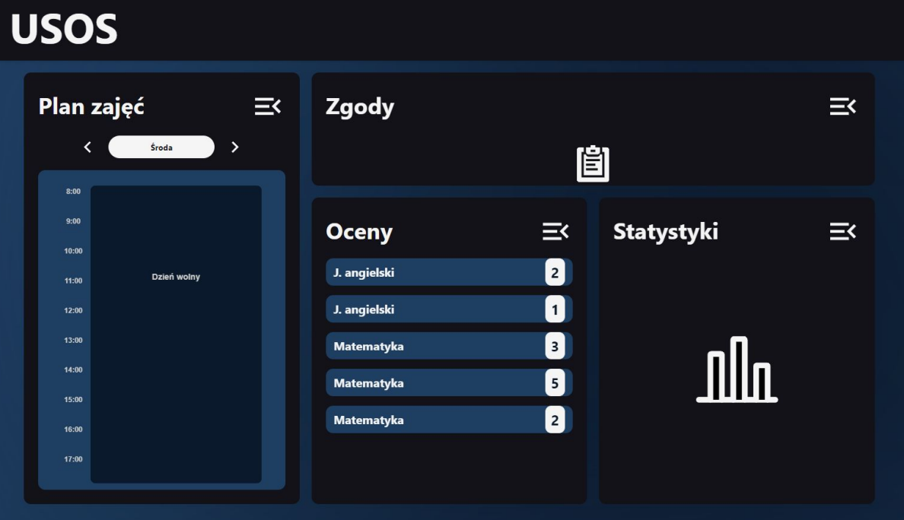
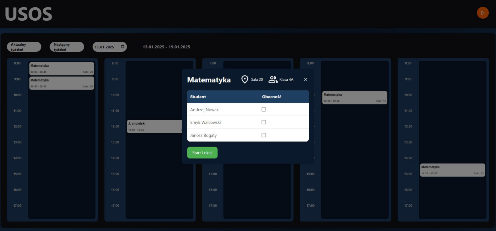
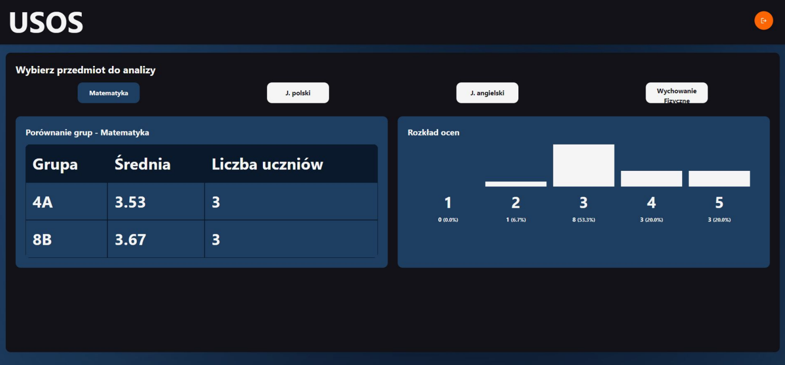
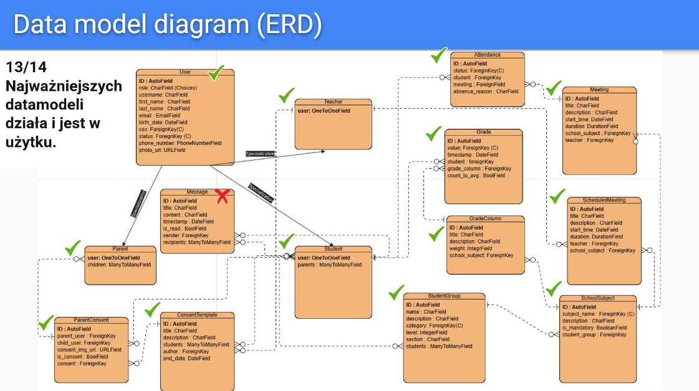
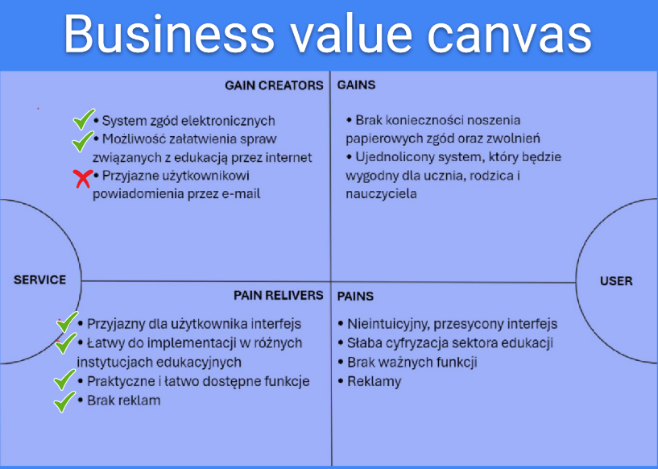

# USOS - "Uniwersalny System Obsługi Szkół" (Universal School Service System)

Web application for managing school tasks (lessons, grades, attendance, electronic consents, ...).  

## About the Project
This project was developed as part of a **three-person team** during software engineering classes. It aims to provide a simplified version of a school management system, inspired by the functionalities of the real **USOS** system.  

The development process was accompanied by the creation of **detailed diagrams**, including 
- Entity-Relationship Diagram (ERD)
- Use Case Diagram (and user stories)
- Deployment Diagram
- Data Flow Diagram
- API map 

which are included in original presentations at the **`./project_presentation`** directory.  

The project consists of a **Django REST API** backend and an **Angular** frontend.

## Features:
- Electronic consent system
- Class schedules  
- Grades tracking  
- Attendance tracking
- Detailed grade statistics
- Views for student, parent and teacher
- And more

<hr/>

All the project presentations are in the ./project_presentation/ directory.

You can view the original project summary by clicking the link below:

<h2 align="center">
  📄 <a href="./project_presentation/UI_UX, Project summary.pdf" target="_blank">View Project Summary</a>
</h2>

*Parent's main view:*


*Starting lesson:*


*Grades stats view:*


*ERD summary:*


*Business value canvas summary:*


## How to run:

**backend:**
```
cd backend/
python manage.py runserver
```

**frontend:**
```
cd frontend-no-standalone/
ng serve --open
```

(You have to install required packages first and run venv but I'm too lazy to explain how to do that)
